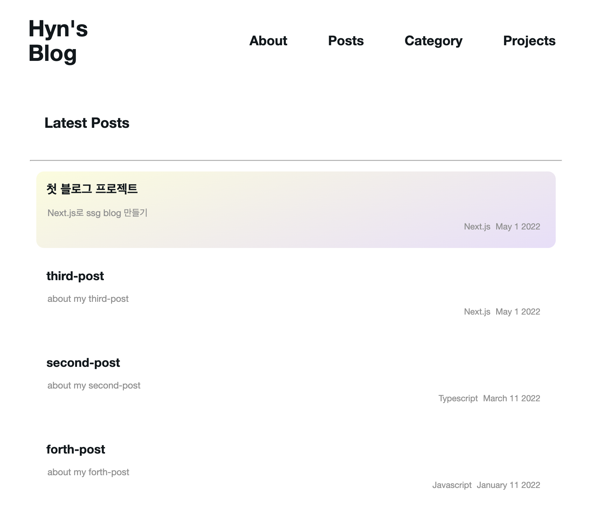

# blog-project

-   [설계](#설계)
-   [구현](#구현)
-   [트러블 슈팅](#트러블-슈팅)
-   [학습한 내용](#학습한-내용)
-   [아쉬운 점, 개선시키고 싶은 부분](#아쉬운-점,개선시키고-싶은-부분)

## 설계

### 목표

-   `next.js`를 사용하여 `ssg` 블로그 만들기

### 인덱스 페이지

-   로고(헤더)
-   메뉴
-   사진과 짧은 본인 소개 및 블로그 소개
-   최근 포스트

### 메뉴

-   about
-   post
-   category
-   projects

#### about

-   본인 소개

#### post

-   블로그 게시물

#### category

-   카테고리별 게시물 모아보기

#### projects

-   완성된 프로젝트 게시 예정

### 사용

| -             | Link                                            |
| :------------ | :---------------------------------------------- |
| Lang          | [typescript](https://www.typescriptlang.org/)   |
| Web Framework | [Next.js](https://nextjs.org/)                  |
| CSS Library   | [Emotion](https://emotion.sh/docs/introduction) |
| CMS           | [MDX](https://github.com/mdx-js/mdx)            |

### 공부 필요

-   next.js 사용법
-   emotion 사용법
-   반응형 디자인 만드는 법
-   seo

### 레이아웃



## 기능 -> 구현

-   경로에 따른 Nav 반응

```jsx
const router = useRouter()
const navPath = router.pathname
const navString = navPath.split('/')

return (
    <NavBox>
        {navdata.map((navItem) => (
            <span key={navItem.href}>
                <Link href={navItem.href}>
                    {`/${navString[1]}` === navItem.href ? (
                        <ActiveNavItem>{navItem.title}</ActiveNavItem>
                    ) : (
                        <a>{navItem.title}</a>
                    )}
                </Link>
            </span>
        ))}
    </NavBox>
)
```

-   포스트 날짜 순 정렬

```jsx
        .sort(({ date: a }, { date: b }) => {
            if (a < b) {
                return 1
            }
            if (a > b) {
                return -1
            }
            return 0
        })
```

-   최신 포스트

```jsx
export const getStaticProps: GetStaticProps = async () => {
    const allData = await getAllPostData().slice(0, 4)

    return {
        props: {
            allData,
        },
    }
}
```

## 트러블 슈팅

-   `<Link>`하위 태그에 emotion.js로 스타일링한 컴포넌트를 작성하였더니 오류가 발생하였음

    -   **passHref** 속성을 넣어줌 href 속성을 강제로 자식 태그에 넘겨준다.

```jsx
const { matterData } = matter(postContents)
```

-   **gray-matter**가 데이터를 불러오지 못함.

    -   `matterData`를 콘솔로 찍으니 **undifined**으로 되어있음.
    -   **gray-matter**은 `content`와 `data`를 키로 가진 객체를 반환 함. 없는 값을 불러와서 오류가 발생한 것
    -   `{data:matterData}`로 수정

-   nav 메뉴가 경로를 완전히 따라오지 못 한다.

    -   이후 경로인 `[slug]`를 인식하지 않아서 발생
    -   '/'를 기준으로 split해준 후 앞부분 값만 불러와서 비교.

에러코드

```jsx
const categoryData = allData.map((data) => data.category)
const set = new Set(categoryData)
const setArr = [...set]
```

수정코드

```jsx
const categoryData = allData.map(({ category }) => category)
const setArr = Array.from(new Set(categoryData))
```

-   **Set**을 사용하여 객체를 만든 다음 **스프레드 문법**을 이용해 **배열**로 바꾼 결과 **타입 오류**가 발생하였다.
    -   에러 내용 Type'Set<string>'is not an array type or a string type
    -   원인: 타입스크립트의 트랜스파일링 문제.
    -   해결법: 스프레드 연산자 대신 **Array.from()사용**, 혹은 **"downlevelIteration": true** 설정을 통해 해결할 수 있다.
        => `Array.from()`을 사용하는 방식을 택함.

## 학습한 내용

-   emotion.js 사용법
    -   styled를 사용하여 스타일링된 요소 추가, 하위요소 스타일링
-   next.js
    -   동적라우팅, data fetch
-   SSR, SSG, CSR 에 대해 알게 되었음.
-   next.js를 공부하며 'fs', 'path'라는 node.js 모듈을 알게되었다.
-   MDX
-   애매하게 알고 있던 flex-box 개념을 한 번 더 되짚어보게 되었다.

## 아쉬운 점,개선시키고 싶은 부분

-   카테고리를 하나만 작성할 수 있는데, 게시물 하나 당 여러 개의 카테고리를 작성해도 잘 분류될 수 있도록 구현하고싶다.

-   아직 모바일형이 완성되지 않았음 반응형 메뉴를 추가해야 함.
